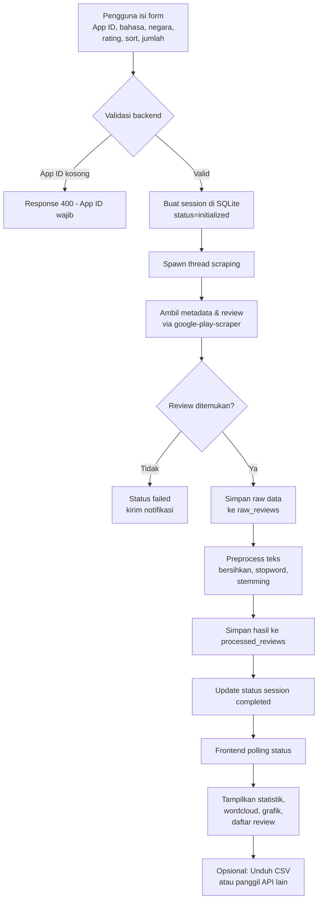

# Dokumentasi SentiPlay

## Gambaran Umum
SentiPlay adalah aplikasi analisis sentimen untuk review aplikasi Android yang diambil langsung dari Google Play Store. Sistem ini memadukan proses scraping, pembersihan teks berbahasa Indonesia, penyimpanan terstruktur, dan visualisasi sehingga pengguna dapat memahami persepsi pengguna aplikasi secara cepat.

## Arsitektur Aplikasi
- **Frontend**: Halaman `templates/index.html` menampilkan form, indikator progres, dan hasil analisis menggunakan HTML, CSS kustom, dan JavaScript untuk memanggil API.
- **Backend**: `app.py` menjalankan FastAPI sebagai web server yang menyediakan endpoint REST, menjalankan thread scraping di background, serta menyajikan file statis.
- **Scraper**: `scraper.py` menggunakan `google-play-scraper` guna mengambil metadata aplikasi dan review sesuai parameter yang diminta.
- **Pemrosesan Teks**: `preprocessing.py` membersihkan kalimat, menghapus stopword, dan melakukan stemming dengan Sastrawi.
- **Visualisasi & Statistik**: `visualization.py` mengolah ringkasan data, wordcloud, dan grafik distribusi rating.
- **Database**: `database.py` mengatur SQLite (`data/reviews.db`) dengan tabel `scraping_sessions`, `raw_reviews`, dan `processed_reviews`.

## Alur Program
1. Pengguna memasukkan App ID, bahasa, negara, batas jumlah review, filter rating, dan metode sorting melalui antarmuka web.
2. Form memanggil `/api/scrape` (POST). FastAPI membuat session baru, membersihkan sesi lama, lalu menjalankan `scrape_reviews_background` di thread terpisah.
3. Thread memanggil `PlayStoreScraper` untuk:
   - Mengambil metadata aplikasi (`get_app_details`).
   - Mengambil review sesuai filter (`scrape_reviews`).
   - Menyimpan hasil ke `raw_reviews` via `DatabaseManager.save_reviews` dan memperbarui status sesi.
4. Setelah penyimpanan, `TextPreprocessor.preprocess_all_reviews` membersihkan setiap review dan menaruh hasilnya di `processed_reviews`.
5. Status sesi diperbarui menjadi `completed` saat scraping dan preprocessing selesai.
6. Endpoint lain menyediakan data:
   - `/api/wordcloud/<session_id>` dan `/api/rating-chart/<session_id>` untuk gambar visual.
   - `/api/statistics/<session_id>` untuk ringkasan angka.
   - `/api/reviews/<session_id>` untuk data paginasi.
   - `/api/download/reviews/<session_id>` untuk ekspor CSV.
7. Frontend melakukan polling status, kemudian menampilkan statistik, wordcloud, grafik rating, dan daftar review dalam tabel.

## Diagram Alir

## Sistem Bisnis
- **Tujuan Utama**: Memberikan insight terhadap persepsi pengguna aplikasi Android untuk kebutuhan riset akademik, pemantauan kualitas produk, atau evaluasi publik.
- **Aktor**: Analis/peneliti (pengguna utama), sistem Google Play (sumber data), dan administrator (memelihara server & database).
- **Nilai Tambah**: Menghemat waktu pengumpulan data, menyediakan preprocessing Bahasa Indonesia otomatis, serta visual cepat untuk presentasi.
- **Proses Bisnis**:
  1. Analis memilih aplikasi target dan konfigurasi scraping.
  2. Sistem mengambil data langsung dari Google Play dan menyimpannya di basis data lokal.
  3. Sistem membersihkan teks, menghitung statistik, dan menghasilkan visual wordcloud/grafik rating.
  4. Analis meninjau hasil melalui dashboard atau mengekspor CSV untuk analisis lanjutan.
  5. Data lama dibersihkan otomatis (`cleanup_old_data`) agar penyimpanan efisien.

## Panduan Penggunaan

### Persyaratan
- Python 3.9+ dan `pip`.
- Koneksi internet untuk scraping data & instalasi dependency.
- (Opsional) Docker & Docker Compose bila ingin menjalankan dalam kontainer.

### Instalasi Manual
1. Clone repo dan masuk ke folder proyek.
2. (Opsional) Buat virtual environment: `python3 -m venv gplay_scraper_env` lalu aktifkan.
3. Instal dependensi: `pip install -r requirements.txt`.
4. Migrasi database: `python migrate_database.py` (akan membuat dan menyiapkan `data/reviews.db`).
5. Jalankan aplikasi: `python app.py` (atau `uvicorn app:app --host 0.0.0.0 --port 5000`).
6. Buka browser ke `http://localhost:5000`.

### Menjalankan dengan Docker
1. Pastikan Docker dan Docker Compose terinstal.
2. Bangun & jalankan: `docker-compose up --build`.
3. Tunggu container FastAPI siap, kemudian akses `http://localhost:5000`.
4. Untuk Portainer, ikuti panduan `PORTAINER-DEPLOY.md` (copy stack YAML yang sudah disediakan).

### Mengoperasikan Aplikasi Web
1. Masukkan `App ID` Google Play (contoh: `com.whatsapp`).
2. Pilih `Language`, `Country`, jumlah review, urutan sortir (`Newest` atau `Most Relevant`).
3. Klik rating tertentu bila ingin memfilter (dapat dikosongkan untuk seluruh rating).
4. Tekan `Scrape Reviews` dan perhatikan progress bar.
5. Setelah selesai, bagian hasil akan menampilkan:
   - Informasi aplikasi dan ringkasan metadata.
   - Statistik total review, rata-rata rating, rentang tanggal review, dan kata paling sering.
   - Wordcloud dan grafik distribusi rating.
   - Tabel review yang bisa difilter/paginasi.
6. Gunakan tombol unduh CSV untuk menyimpan seluruh review.

### Referensi Endpoint API
- `POST /api/scrape` — Mulai proses scraping baru.
- `GET /api/scrape/status/<session_id>` — Cek status scraping/preprocessing.
- `GET /api/statistics/<session_id>` — Ambil statistik agregat.
- `GET /api/reviews/<session_id>?page=1&limit=20` — Ambil data review terpagasi.
- `GET /api/wordcloud/<session_id>` — Ambil gambar wordcloud (PNG).
- `GET /api/rating-chart/<session_id>` — Ambil gambar distribusi rating (PNG).
- `GET /api/download/reviews/<session_id>` — Unduh seluruh review dalam CSV.
- `GET /health` — Endpoint health-check untuk monitoring.

### Tips & Troubleshooting
- Jika scraping gagal, periksa koneksi internet atau pastikan App ID valid.
- Database dibersihkan otomatis setiap kali scraping (menyisakan maksimal 5 session terbaru, ≤3 hari). Pastikan storage cukup.
- Untuk environment produksi, set `FASTAPI_ENV=production` agar server binding ke `0.0.0.0`.
- Wordcloud memerlukan data hasil preprocessing; jika kosong, periksa tabel `processed_reviews` atau dependency Sastrawi.
